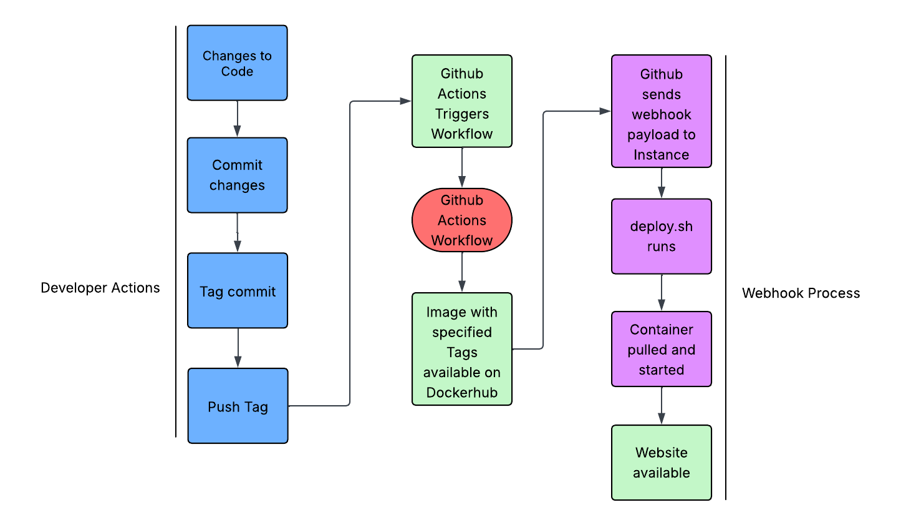

# Continuous Deployment Project
### Goal
The goal of this project was to set up a continuous development process using webhook and an Amazon AWS EC2 instance. The project built on the CI project which uploaded new tagged versions of a docker container to Docker Hub when pushed to Github. This project involved setting up a webhook that will, when a new tag is pushed, pull the new version from Docker Hub and deploy it to the EC2 instance, keeping it updated with new releases.

### Tools Used
- Github Actions
  - Actions
    - checkout (checks out the repository)
  - Docker
    - metadata-action (generates metadata tags for docker images based on tags pushed to Github)
    - login-action (logs into Dockerhub, allowing for access to push images)
    - setup-buildx-action (sets up Docker Buildx, which is used for building Docker images)
    - build-push-action (builds the Docker image and pushes it to Dockerhub)
- Dockerhub
  - Contains the images and tags that are pushed
- Git/Github
  - Activates the actions based on the workflow
  - Sends the payload to the webhook
- Workflow file
  - Specifies the actions that should be taken when a tag/commit is pushed to Github
- Webhook
  - Provides the listener that pulls and deploys the web content when new tags are pushed
- AWS
  - Provides the EC2 instance that the webhook listener and web content is hosted on

 ### Continuous Deployment Process Diagram
 

# Part 1: Script a Refresh
### EC2 Instance Details
- AMI information
  - Ubuntu Server 24.04
- Instance type
  - t2.medium
- Recommended volume size
  - 30GB volume storage
- Security Group configuration
  - SSH
    - Home IP
    - WSU CIDR
  - HTTP
    - Any IP
- Security Group configuration justification / explanation
  - I needed to be able to access the instance with SSH from home or Wright State, and I need the website to be able to recieve traffic so the HTTP is open to any IP
### Docker Setup on OS on the EC2 instance
- How to install Docker for OS on the EC2 instance
```
sudo apt-get update
sudo apt-get upgrade
curl -fsSL https://get.docker.com -o get-docker.sh
sh get-docker.sh
sudo usermod -aG docker $USER
sudo systemctl enable docker
```
- How to confirm Docker is installed and that OS on the EC2 instance can successfully run containers
  - Run `systemctl status docker.service` to ensure it is running
  - Use `docker run hello-world` to ensure it can properly pull and run images
### Testing on EC2 Instance
- How to pull container image from DockerHub repository
  - `docker pull dawson118/panda-site:latest`
- How to run container from image
  - `docker run -d -p 80:80 --name panda-site dawson118/panda-site`
    - Runs the image in detached mode, allowing it to run as a background process so you can leave it running
  - `docker run -it -p 80:80 --name panda-site dawson118/panda-site`
    - Runs the image as a foreground process so you cannot do anything else until you have stopped the container
  - I would recommend using the -d flag so that you can do other work while testing and not have to worry about restarting it each time you want to access the website
- How to verify that the container is successfully serving the web applicatio
  - Run this command: `curl http://instance-public-ip:80`
  - Go to `http://instance-public-ip:80` in your web browser
### Scripting Container Application Refresh
- Description of the bash script
  - Stop the container
  - Remove/delete the container
  - Pull the latest image from Docker Hub
  - Run the container in detached mode with the name panda-site
  - Print a success message to the console
- How to test / verify that the script successfully performs its taskings
  - Run the script
  - Use `docker ps -a` to ensure the container is running and you can see when it was created
  - Go to `http://instance-public-ip:80` in your web browser to ensure the container is actually running properly
- Link to [Bash Script](deployment/deploy.sh)

# Part 2: Listen
### Configuring a webhook Listener on EC2 Instance
- How to install adnanh's webhook to the EC2 instance
  - `sudo apt install webhook`
- How to verify successful installation
  - `webhook --version`
  - `sudo systemctl status webhook.service`
- Summary of the webhook definition file
  - names the hook id as deploy-container
  - executes the deploy.sh script
  - sets working directory to /home/ubuntu so it can find the script
  - ensures that the payload sent matches with the signature from GitHub
  - uses a shared secret to validate the signature sent from Github
  - searches for the X-Hub-Signature for verification in the header of the request
- How to verify definition file was loaded by webhook
  - `webhook -hooks /home/ubuntu/hooks.json -verbose`
  - ensure it says "loaded: deploy-container"
- How to verify webhook is receiving payloads that trigger it
  - how to monitor logs from running webhook
    - `sudo journalctl -u webhook.service -f`
  - what to look for in docker process views
    - use `docker ps -a`
    - check how long the container has been up for, it should be about as long as it has been since the webhook was triggered
- LINK to definition file in repository
  - [Webhook definition file](deployment/hooks.json)
### Configure a webhook Service on EC2 Instance
Summary of webhook service file contents
  - starts the service using hooks.json
  - restart always to ensure its always running
How to enable and start the webhook service
  - `sudo systemctl enable webhook.service`
  - `sudo systemctl start webhook.service`
How to verify webhook service is capturing payloads and triggering bash script
  - `sudo journalctl -u webhook.service -f`
  - you can check and see the process going through in the console
  - `docker ps -a` and ensure the container was recently re-pulled and run
LINK to service file in repository
  - [Webhook service file](deployment/webhook.service)

# Part 3: Send a Payload
### Configuring a Payload Sender
- Justification for selecting GitHub or DockerHub as the payload sender
  - Github was selected for this project. I chose this so that I could select what specific events trigger the webhook. This way I can set it so it only triggers when I want it to, while Docker Hub does not allow the same specifics and triggers specifically on push
- How to enable your selection to send payloads to the EC2 webhook listener
  1. Navigate to the Github repo for the project
  2. Click settings
  3. Click webhooks in the menu on the left
  4. Click "add webhook"
  5. Enter the URL into the dialogue box: http://98.95.49.125:9000/hooks/deploy-container
  6. Select application/json for content type
  7. Set the secret to be used for verification
  8. Select individual events for trigger
  9. Click create
- Explain what triggers will send a payload to the EC2 webhook listener
  - I have it set up to only trigger on a tag push to Github. This way, the webhook will only trigger when a tag is pushed. This way, the container will be redeployed whenever a new version is uploaded
- How to verify a successful payload delivery
  1. Navigate back to webhooks in Github and click the webhook you wish to view
  2. Click "Recent Deliveries"
  3. Here you can select deliveries to view and whether or not they were successful, as well as see the actual payload
- How to validate that your webhook only triggers when requests are coming from appropriate sources (GitHub or DockerHub)
  - The webhook can only trigger when requests come from Github because there is a shared secret set up, and if a source doesn't send a signature using the secret, then it will not trigger 

# References:
- Github: I used a Github Forums page to confirm the journalctl command to check webhook logs
- This was used as a basic reference for setting up the webhook:
  - https://github.com/adnanh/webhook
- These were used to assist with setup and process for CD:
  - https://levelup.gitconnected.com/automated-deployment-using-docker-github-actions-and-webhooks-54018fc12e32
  - https://blog.devgenius.io/build-your-first-ci-cd-pipeline-using-docker-github-actions-and-webhooks-while-creating-your-own-da783110e151
- This was used as an extra reference for setting up the service file:
  - https://linuxhandbook.com/create-systemd-services/
- The class lectures and recordings were used extensively to help walk through the process
