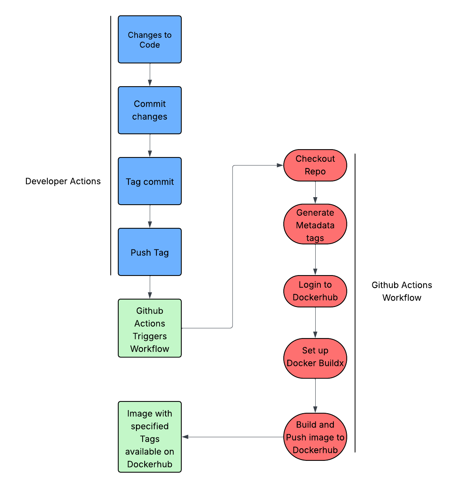

# Project Overview
### Project Goal
The goal of this project was to configure a workflow that would build and push images to Dockerhub with specific tags whenever a tag is pushed to Github

### Tools Used
- Github Actions
  - Actions
    - checkout (checks out the repository)
  - Docker
    - metadata-action (generates metadata tags for docker images based on tags pushed to Github)
    - login-action (logs into Dockerhub, allowing for access to push images)
    - setup-buildx-action (sets up Docker Buildx, which is used for building Docker images)
    - build-push-action (builds the Docker image and pushes it to Dockerhub)
- Dockerhub
  - Contains the images and tags that are pushed
- Git/Github
  - Activates the actions based on the workflow
- Workflow file
  - Specifies the actions that should be taken when a tag/commit is pushed to Github

### Continuous Integration Process Diagram

## Part 1: Create a Docker Container Image
### Web Content
The website was generated using ChatGPT and is themed around Panda Bears.

The index.html file contains an image of a panda bear and a quick overview of what they are
- [index.html](web-content/index.html)

The facts.html file contains a few fun facts about pandas
- [facts.html](web-content/facts.html)

The styles.css file contains the code that determines the style of the page
- [styles.css](web-content/styles.css)

### Dockerfile
The Dockerfile builds from the base image httpd:2.4 and copies the content for the panda site to the default location for httpd in apache2.
[Dockerfile](Dockerfile)

### How to build and push container
- Must be in the same directory as Dockerfile
- run `docker build -t dawson118/panda-site:latest .`
- following the image name, tag the image with `:latest` to define the newest version or a version number like `:v*.*.*`
- Log into Docker Hub on the command line
  - Go to Docker Hub in the browser and open settings
  - Click Personal Access Tokens
  - Fill in the information
  - Recommended "Read and Write" or "Read, Write, and Delete" privileges 
  - Generate token
  - Copy token (you only have one chance)
  - In the command line, run `docker login -u username`
  - Enter PAT when prompted
- run `docker push dawson118/panda-site:latest`
- [Repository on Docker Hub](https://hub.docker.com/repositories/dawson118)

### How to run container
Make sure you have the image on your local system:
`docker pull dawson118/panda-site`
Then run the following to run the container:
`docker run -p 8080:80 dawson118/panda-site`

## Part 2: Github Actions and Dockerhub
### Configuring GitHub Repository Secrets:
- How to create a PAT for authentication
  - Go to Docker Hub and select your profile
  - Click Account Settings
  - On the left, click Personal Access Tokens
  - Click Generate Token
  - Enter a description, expiration date, and choose permissions (recommended read and write permissions for this project)
  - Click generate
  - Copy key somewhere secure
- How to set repository Secrets for use by GitHub Actions
  - Go to your Github repository
  - Click settings on the top bar
  - Select Secrets and Variables from the left, and choose Actions
  - Click New Repository Secret and enter a name and the secret
- Describe the Secrets set for this project
  - I have a secret named `DOCKER_USERNAME` that contains my username to log into Docker Hub
  - The other secret is named `DOCKER_TOKEN` and contains the PAT necessary to log into Docker Hub

### CI with GitHub Actions
- Explanation of workflow trigger
  - The workflow triggers on a push to the main branch
- Explanation of workflow steps
  - Checkout to the repository
  - Login to Docker Hub using the secrets in the Github repo
  - Set up Docker Buildx which is for building images
  - Build the Docker image and push it to Docker Hub
- Explanation / highlight of values that need updated if used in a different repository
  - Change `DOCKER_USERNAME` to the either the proper username used to login or a secret in your personal repo that holds your Docker username
  - Change `DOCKER_TOKEN` to either the token (not recommended for security), or a secret in your personal repo that holds the token.
  - Change `dawson118/panda-site:latest` to the proper `repo/image:tag` you are trying to pull
  - Change `main` to the branch that you wish to run the action on
- Link to workflow file in your GitHub repository
  - [Workflow File](.github/workflows/project4-flow.yml)

### Testing & Validating
- How to test that your workflow did its tasking
  - After pushing a commit to the Github repo, go to the Actions tab
  - Here you can see which steps of the workflow completed properly
- How to verify that the image in DockerHub works when a container is run using the image
  - Pull the image with `docker pull dawson118/panda-site:latest`
  - Run the image with `docker run -p 8080:80 dawson118/panda-site:latest`
- Link to your DockerHub repository
  - [DockerHub Repository](https://hub.docker.com/repositories/dawson118)

## Part 3: Semantic Versioning
### Generating tags
- How to see tags in a git repository
  - Use `git tag`
- How to generate a tag in a git repository
  - Make sure to `git add` and `git commit` first
  - Use `git tag -a v*.*.* -m "tag message"` (Replace `v*.*.*` with the proper tag)
- How to push a tag in a git repository to GitHub
  - `git push origin v*.*.*`
### Semantic Versioning Container Images with GitHub Actions
- Explanation of workflow trigger
  - The workflow triggers when a tag matching the `v*.*.*` format is pushed to the repo
- Explanation of workflow steps
  - Checkout the repository
  - Create tags for the Docker image
  - Login to Docker Hub using the secrets in the Github repo
  - Set up Docker Buildx which is for building images
  - Build the Docker image and push it to Docker Hub with the generated metadata tags
- Explanation / highlight of values that need updated if used in a different repository
  - Change `DOCKER_USERNAME` to the either the proper username used to login or a secret in your personal repo that holds your Docker username
  - Change `DOCKER_TOKEN` to either the token (not recommended for security), or a secret in your personal repo that holds the token.
  - Change `dawson118/panda-site:latest` to the proper `repo/image:tag` you are trying to pull
- Link to workflow file in your GitHub repository
  - [Workflow File](.github/workflows/project4-flow.yml)
### Testing & Validating
- How to test that your workflow did its tasking
  - After pushing a tag to the Github repo, go to the Actions tab
  - Here you can see which steps of the workflow completed properly
  - You can also check the Dockerhub repo to see all the tags properly uploaded
- How to verify that the image in DockerHub works when a container is run using the image
  - Pull the version you wish to test and run it with `docker run -p 8080:80 dawson118/panda-site:version`
- Link to your DockerHub repository with evidence of the tag set
  - [Dockerhub Repository](https://hub.docker.com/repository/docker/dawson118/panda-site/general)

## Resources
- https://docs.docker.com/build/ci/github-actions/
  - This was used to learn the general actions that would be used in the project
- https://github.com/marketplace/actions/build-and-push-docker-images
- https://docs.github.com/en/actions/tutorials/publish-packages/publish-docker-images#publishing-images-to-docker-hub
  - These were used to learn the proper formatting and setup for the build and push workflow
- https://github.com/docker/metadata-action?tab=readme-ov-file#semver
- https://docs.docker.com/build/ci/github-actions/manage-tags-labels/
  - These were used to learn how to properly set up tags in the workflow file
- https://www.lucidchart.com/pages
  - This was used to create the CI Diagram
- ChatGPT
  - Used to create the web content for a previous project, which was then copied to this project
